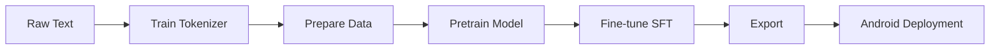

# 100M Parameter Bengali Language Model

A complete, production-ready codebase for training a 100 million parameter language model from scratch, optimized for Bengali text and Android deployment.


## 🌟 Features

- **Custom Transformer Architecture**: Decoder-only model with ~100M parameters
- **Rotary Position Embeddings (RoPE)**: Modern positional encoding for better long-range dependencies
- **SwiGLU Activation**: Advanced feed-forward network design
- **Mixed Precision Training**: Support for FP16/BF16 to accelerate training
- **Flexible Training**: Both pretraining and supervised fine-tuning (SFT)
- **Android Export**: Convert to ONNX, TensorFlow Lite, or GGUF formats
- **Google Colab Ready**: Complete notebook for training on free T4 GPU
- **Production Ready**: Comprehensive logging, checkpointing, and error handling

## 📋 Table of Contents

- [Project Structure](#project-structure)
- [Installation](#installation)
- [Quick Start](#quick-start)
- [Training Pipeline](#training-pipeline)
- [Model Architecture](#model-architecture)
- [Android Deployment](#android-deployment)
- [Configuration](#configuration)
- [License](#license)

## 📁 Project Structure

```
project/
├── configs/
│   └── model_config.yaml          # Model and training configuration
├── data/
│   ├── raw/                       # Raw text files (add your data here)
│   ├── processed/                 # Tokenized training data
│   └── examples/                  # Sample SFT data
├── src/
│   ├── model.py                   # Transformer model implementation
│   ├── tokenizer.py               # BPE tokenizer training
│   ├── dataset.py                 # Dataset loading and preprocessing
│   ├── train.py                   # Training pipeline
│   └── utils.py                   # Helper functions
├── scripts/
│   ├── train_tokenizer.py         # Train tokenizer
│   ├── prepare_data.py            # Prepare training data
│   ├── pretrain.py                # Pretrain model
│   ├── sft.py                     # Supervised fine-tuning
│   ├── generate.py                # Text generation
│   └── export.py                  # Export to Android formats
├── colab_notebook.ipynb           # Google Colab training notebook
├── requirements.txt               # Python dependencies
└── README.md                      # This file
```

## 🚀 Installation

### Local Setup

1. **Clone the repository**:
```bash
git clone https://github.com/yourusername/bengali-lm-100m.git
cd bengali-lm-100m
```

2. **Create virtual environment**:
```bash
python -m venv venv
source venv/bin/activate  # On Windows: venv\Scripts\activate
```

3. **Install dependencies**:
```bash
pip install -r requirements.txt
```

### Google Colab

Simply open `colab_notebook.ipynb` in Google Colab and follow the step-by-step instructions. All dependencies will be installed automatically.

[](https://colab.research.google.com/github/yourusername/bengali-lm-100m/blob/main/colab_notebook.ipynb)

## ⚡ Quick Start

### 1. Prepare Your Data

Add Bengali text files (`.txt`) to the `data/raw/` directory:

```bash
# Example: Download Bengali text
wget -O data/raw/sample.txt "YOUR_DATA_URL"

# Or use Hugging Face datasets
python -c "
from datasets import load_dataset
dataset = load_dataset('oscar', 'unshuffled_deduplicated_bn', split='train[:10000]')
with open('data/raw/oscar_bn.txt', 'w', encoding='utf-8') as f:
    for item in dataset:
        f.write(item['text'] + '\n')
"
```

### 2. Train Tokenizer

```bash
python scripts/train_tokenizer.py \
    --data_dir data/raw \
    --output_dir tokenizer \
    --vocab_size 32000
```

### 3. Prepare Training Data

```bash
python scripts/prepare_data.py \
    --raw_data_dir data/raw \
    --output_dir data/processed \
    --tokenizer_path tokenizer \
    --block_size 2048
```

### 4. Pretrain Model

```bash
python scripts/pretrain.py \
    --config configs/model_config.yaml \
    --output_dir outputs/pretrain
```

### 5. Generate Text

```bash
python scripts/generate.py \
    --model_path outputs/pretrain/best_model \
    --prompt "একবার এক" \
    --max_length 200
```

### 6. (Optional) Fine-tune with Instructions

Create an SFT dataset in JSONL format:

```json
{"instruction": "বাংলাদেশের রাজধানী কী?", "response": "বাংলাদেশের রাজধানী ঢাকা।"}
{"instruction": "পদ্মা সেতু কোথায়?", "response": "পদ্মা সেতু মুন্সীগঞ্জ ও শরীয়তপুর জেলাকে সংযুক্ত করেছে।"}
```

Then run:

```bash
python scripts/sft.py \
    --model_path outputs/pretrain/best_model \
    --data_path data/examples/sft_data.jsonl \
    --output_dir outputs/sft
```

### 7. Export for Android

```bash
python scripts/export.py \
    --model_path outputs/pretrain/best_model \
    --output_dir exports \
    --format all \
    --quantize
```

## 🏗️ Training Pipeline

### Complete Training Flow



### Training Details

**Pretraining**:
- **Objective**: Next-token prediction on large text corpus
- **Duration**: 4-8 hours on T4 GPU (depends on data size)
- **Batch Size**: 32 (effective: 128 with gradient accumulation)
- **Learning Rate**: 3e-4 with cosine decay
- **Mixed Precision**: BF16 for faster training

**Supervised Fine-Tuning**:
- **Objective**: Instruction following
- **Duration**: 1-2 hours
- **Batch Size**: 16 (effective: 32)
- **Learning Rate**: 1e-4 (lower for stability)

## 🧠 Model Architecture

### Specifications

| Component | Value |
|-----------|-------|
| **Parameters** | ~100M |
| **Layers** | 6 |
| **Hidden Size** | 768 |
| **Attention Heads** | 12 |
| **Intermediate Size** | 2048 |
| **Vocabulary Size** | 32,000 |
| **Max Context Length** | 2048 tokens |

### Architecture Details

- **Type**: Decoder-only Transformer (GPT-like)
- **Position Encoding**: Rotary Position Embeddings (RoPE)
- **Activation**: SwiGLU in feed-forward layers
- **Normalization**: Pre-LayerNorm formulation
- **Attention**: Multi-head causal self-attention

### Why These Choices?

1. **RoPE**: Better extrapolation to longer sequences
2. **SwiGLU**: Improved performance over standard ReLU/GELU
3. **Pre-LayerNorm**: More stable training
4. **100M params**: Sweet spot for mobile deployment (reasonable accuracy, fast inference)

## 📱 Android Deployment

### Export Formats

#### 1. ONNX (Recommended)
```bash
python scripts/export.py --format onnx
```

**Pros**: 
- Cross-platform
- Good optimization support
- ONNX Runtime Mobile available

**Integration**:
```kotlin
// Add to build.gradle
implementation 'com.microsoft.onnxruntime:onnxruntime-android:1.15.0'

// Load model
val session = OrtEnvironment.getEnvironment()
    .createSession("model.onnx")
```

#### 2. TensorFlow Lite
```bash
python scripts/export.py --format tflite --quantize
```

**Pros**:
- Optimized for mobile
- Native Android support
- Dynamic quantization reduces size

**Integration**:
```kotlin
// Add to build.gradle
implementation 'org.tensorflow:tensorflow-lite:2.13.0'

// Load model
val interpreter = Interpreter(loadModelFile("model.tflite"))
```

#### 3. GGUF (llama.cpp)
```bash
# Requires llama.cpp installation
# See scripts/export.py for details
```

**Pros**:
- Extremely optimized inference
- Quantization options (4-bit, 8-bit)
- Active development community

### Model Size Comparison

| Format | Size (Full) | Size (Quantized) |
|--------|-------------|------------------|
| PyTorch | ~400 MB | - |
| ONNX | ~400 MB | ~200 MB (FP16) |
| TFLite | ~400 MB | ~100 MB (INT8) |
| GGUF | ~400 MB | ~50 MB (Q4_0) |

## ⚙️ Configuration

Edit `configs/model_config.yaml` to customize training:

### Model Configuration
```yaml
model:
  vocab_size: 32000
  hidden_size: 768
  num_hidden_layers: 6
  num_attention_heads: 12
  max_position_embeddings: 2048
```

### Training Configuration
```yaml
training:
  batch_size: 32
  gradient_accumulation_steps: 4
  learning_rate: 3.0e-4
  num_train_epochs: 3
  warmup_steps: 500
  fp16: false
  bf16: true  # Use bf16 for A100/H100
```

### Hardware Recommendations

| Hardware | Batch Size | Mixed Precision | Training Time |
|----------|-----------|-----------------|---------------|
| T4 (16GB) | 16-32 | BF16/FP16 | 6-8 hours |
| V100 (32GB) | 32-64 | FP16 | 4-6 hours |
| A100 (40GB) | 64-128 | BF16 | 2-4 hours |
| CPU | 4-8 | FP32 | 2-3 days |

## 📊 Monitoring Training

### Weights & Biases Integration

Enable W&B logging in config:

```yaml
training:
  log_to_wandb: true
  wandb_project: "bengali-lm-100m"
```

Then login before training:
```bash
wandb login
```

### Training Metrics

Monitor these key metrics:
- **Loss**: Should decrease steadily (target: < 5.0)
- **Perplexity**: exp(loss), lower is better
- **Learning Rate**: Follows warmup + cosine decay
- **GPU Memory**: Watch for OOM errors

## 🔧 Troubleshooting

### Out of Memory (OOM)

**Solutions**:
1. Reduce batch size in config
2. Increase gradient accumulation steps
3. Enable gradient checkpointing:
   ```yaml
   training:
     gradient_checkpointing: true
   ```
4. Use smaller sequence length:
   ```yaml
   data:
     block_size: 1024  # Instead of 2048
   ```

### Slow Training

**Solutions**:
1. Enable mixed precision (BF16/FP16)
2. Increase batch size if memory allows
3. Use `torch.compile()` (PyTorch 2.0+)
4. Reduce number of data loader workers

### Poor Generation Quality

**Solutions**:
1. Train longer (more epochs/steps)
2. Add more diverse training data
3. Tune generation parameters:
   - Lower temperature (0.7-0.8)
   - Adjust top_k/top_p
4. Fine-tune on instruction data

## 📚 Example Datasets

### Bengali Text Corpora

1. **OSCAR**: Large web-crawled corpus
```python
from datasets import load_dataset
dataset = load_dataset("oscar", "unshuffled_deduplicated_bn")
```

2. **CC-100**: Common Crawl Bengali
```python
dataset = load_dataset("cc100", lang="bn")
```

3. **Wikipedia**: Bengali Wikipedia dump
```python
dataset = load_dataset("wikipedia", "20220301.bn")
```

4. **Bengali Books**: NCTB textbooks, classic literature

### Creating SFT Datasets

Format your instruction data as JSONL:

```python
import json

data = [
    {
        "instruction": "প্রশ্ন",
        "response": "উত্তর",
        "input": ""  # Optional context
    }
]

with open('sft_data.jsonl', 'w', encoding='utf-8') as f:
    for item in data:
        f.write(json.dumps(item, ensure_ascii=False) + '\n')
```

## 🤝 Contributing

Contributions are welcome! Please:

1. Fork the repository
2. Create a feature branch
3. Make your changes
4. Add tests if applicable
5. Submit a pull request

## 📄 License

This project is licensed under the MIT License - see below:

```
MIT License

Copyright (c) 2024

Permission is hereby granted, free of charge, to any person obtaining a copy
of this software and associated documentation files (the "Software"), to deal
in the Software without restriction, including without limitation the rights
to use, copy, modify, merge, publish, distribute, sublicense, and/or sell
copies of the Software, and to permit persons to whom the Software is
furnished to do so, subject to the following conditions:

The above copyright notice and this permission notice shall be included in all
copies or substantial portions of the Software.

THE SOFTWARE IS PROVIDED "AS IS", WITHOUT WARRANTY OF ANY KIND, EXPRESS OR
IMPLIED, INCLUDING BUT NOT LIMITED TO THE WARRANTIES OF MERCHANTABILITY,
FITNESS FOR A PARTICULAR PURPOSE AND NONINFRINGEMENT. IN NO EVENT SHALL THE
AUTHORS OR COPYRIGHT HOLDERS BE LIABLE FOR ANY CLAIM, DAMAGES OR OTHER
LIABILITY, WHETHER IN AN ACTION OF CONTRACT, TORT OR OTHERWISE, ARISING FROM,
OUT OF OR IN CONNECTION WITH THE SOFTWARE OR THE USE OR OTHER DEALINGS IN THE
SOFTWARE.
```

## 🙏 Acknowledgments

- **Hugging Face**: Transformers and Tokenizers libraries
- **PyTorch Team**: Deep learning framework
- **Google Colab**: Free GPU resources
- **RoFormer Paper**: Rotary Position Embeddings
- **GLU Variants Paper**: SwiGLU activation

## 📞 Support

- **Issues**: [GitHub Issues](https://github.com/yourusername/bengali-lm-100m/issues)
- **Discussions**: [GitHub Discussions](https://github.com/yourusername/bengali-lm-100m/discussions)

## 🗺️ Roadmap

- [ ] Add evaluation scripts (perplexity, BLEU)
- [ ] Support for multi-GPU training (DDP)
- [ ] LoRA/QLoRA fine-tuning support
- [ ] Pre-trained checkpoint release
- [ ] Android sample app
- [ ] Benchmarks on Bengali NLU tasks

---

**Built with ❤️ for the Bengali language community**

*Star ⭐ this repo if you find it useful!*
